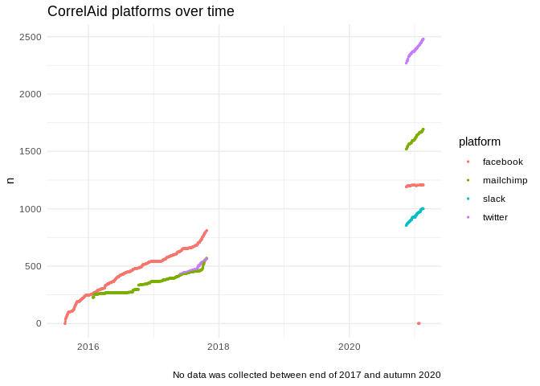
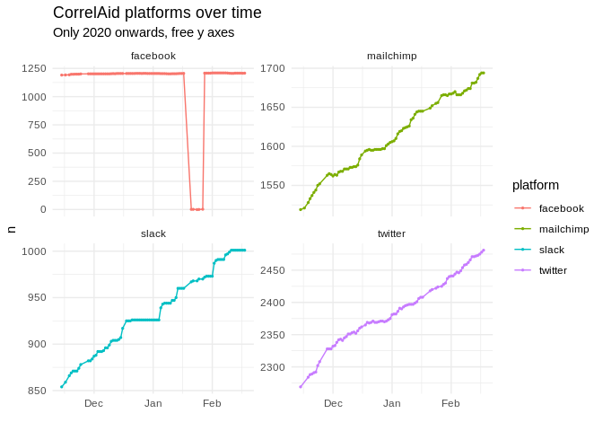

correlaid-utils
================

This repository contains utility tools for CorrelAid.

:warning: Code in mailchimp-welcomemail is very outdated! Code was
developed by [Frie](https://github.com/friep) back in 2017 but has not
been actively used / maintained since 2018. The repository was solely
open sourced for the purpose of Frie’s talk at the [Open Online Data
Meetup](https://www.eventbrite.com/e/the-lazy-data-scientist-automating-things-feat-r-python-aws-and-a-pi-registration-121498787143).
Code in `correlaid-analytics` has been updated for a talk in November
2020 but please still proceed with caution :warning:

Relevant older versions of this repository: - [correlaid-analytics
Python / Serverless
version](https://github.com/friep/correlaid-utils/releases/tag/serverless-python)
- [correlaid-analytics old R
version](https://github.com/friep/correlaid-utils/releases/tag/rstats-old)

## correlaid-analytics

Code to get twitter follower, facebook likes, newsletter subscriber
count and general network data on a daily basis using
[{smcounts}](https://github.com/friep/smcounts).

### Plots

*last updated*: 2020-12-13 14:42:44

<!-- -->

<!-- -->

### Read the data

``` r
ca_counts <- readr::read_csv("https://raw.githubusercontent.com/friep/correlaid-utils/main/correlaid-analytics/data/all_daily.csv")
```

### Deployment on Raspberry Pi

    install.packages("bspm")
    bspm::enable()
    install.packages("remotes")
    install.packages("cronR")
    install.packages("gert") # requires libssl-dev and libgit2-dev (install with sudo apt install)

1.  install [{smcounts}](https://github.com/friep/smcounts) and its
    dependencies
2.  copy `.Renviron` with all necessary environment variables and the
    `.slackr` file to the `correlaid-analytics` folder on the Raspberry
    Pi.
3.  Copy `rtweet_token.rds` to home directory on Raspberry Pi (set
    `TWITTER_PAT` accordingly in .Renviron)
4.  Run `cron.R` to set up cron job: `Rscript path/to/cron.R`. Check
    with `crontab -l`
5.  add a `GITHUB_PAT` (GitHub Personal Access Token) to `.Renviron`.
    This is needed for the authentication with GitHub.

### GitHub Action

Every morning at 7am, GitHub Actions run to see whether a commit was
made to the `all_daily.csv` file. If not, then the build fails and I’ll
get notified via email about the failed pipeline.

## mailchimp-welcomemail (:warning: deprecated!)

This folder contains the code to automatically send out the welcome
email to new subscribers to our newsletter once a day.

### How does it work?

All the code resides on a raspberry pi which is located in @friep’s
flat. The individual steps are all wrapped in a bash file
(runscripts.sh) that executes the scripts in their order. This bash file
itself is scheduled to run each night on the raspberry pi using
cronjobs.

The scripts are in the order they are executed by runscripts.sh:

1.  get\_new\_subs.R: query the Mailchimp API for our newsletter
    subscriber list and write newly subscribed users to a temporary csv
    file.
2.  send\_mails.py: read in the temporary file and send out mails to the
    newly subscribed users by connecting to our mail server.
3.  send\_logs.py: send log files to @friep’s correlaid address.
